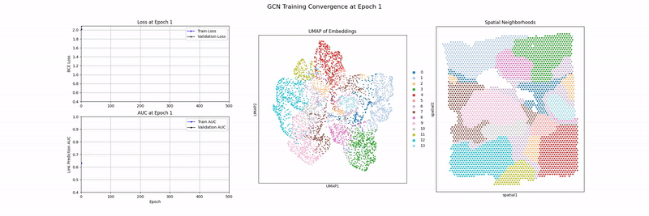

# Data Science for Genomics and Precision Medicine

This repository serves as a collection of data science projects exploring complex challenges in bioinformatics, genomics, and computational biology. The notebooks within this collection apply advanced statistical modeling and machine learning techniques to real-world biological datasets, with a focus on uncovering insights relevant to drug discovery, cancer research, and precision medicine.

## Table of Contents

* [About This Repository](#about-this-repository)
* [Projects](#projects)
    * [1. Exploratory Data Analysis (EDA) of Gene Expression Data](#exploratory-data-analysis-(eda)-of-gene-expression-data)
    * [2. Prognostic Gene Signature in Breast Cancer](#project-1-prognostic-gene-signature-in-breast-cancer)
    * [3. Graph Neural Network to Identify Tumor Cell Neighborhoods (Spatial Transcriptiomics)](#craph-neural-network-to-identify-tumor-cell-neighborhoods-(spatial-transcriptiomics))
    * [4. Generative AI Model (VAE) to Predict Gene Expression from Drug SMILES](generative-ai-model-(vae)-to-predictgene-expression-from-drug-smiles)
* [Setup & Installation](#setup--installation)


---

## About This Repository

The goal of this repository is to demonstrate the application of data science methodologies to biological data. Each project is contained within a self-explanatory Jupyter Notebook and tackles a specific question, from fundamental survival analysis to high-dimensional feature selection and model interpretation.

This repository is designed for data scientists, bioinformaticians, and researchers interested in the intersection of data science and genomics. It provides a practical framework for understanding how to apply statistical methods and machine learning techniques to biological datasets, particularly in the context of cancer research.

---

## Projects

### 1. Exploratory Data Analysis (EDA) of Gene Expression Data

* **Notebook:** `notebooks/brca_gene_expression_eda.ipynb`

* **Description:** The objective of this notebook is to perform a comprehensive exploratory data analysis on the TCGA-BRCA RNA-sequencing dataset and define which genes are candidates for predictive modeling based on differential expression in tumor tissue vs. normal tissue.

* **Core Topics**:
  * Differential Gene Expression Analysis
  * Feature Selection Techniques (Variance Filtering)
  * High Dimensional Analysis and Visualization (UMAP)

* **Key Findings:**

  * **Gene Expression Data Reflects Known Biology**: Housekeeping genes included mitochondrial and riboxomal genes, validating the biological plausibility of the data.

  * **The Cancer Signal is a Dominant Source of Variation.**: A primary driver of variation in the dataset is the cancer phenotype itself, validated by UMAP plot of the high-variance genes between tumor samples and normal tissue samples.

  * **Specific Genes are Massively Dysregulated in Tumors**: A differential expression analysis pinpointed 73 statistically significant genes that are either up- (potential oncogenes) or down-regulated (potential tumor supressors) in cancer cells.

---

### 2. Prognostic Gene Signature in Breast Cancer

* **Notebook:** `notebooks/brca_gene_expression_survival.ipynb`

* **Description:** This project performs an end-to-end survival analysis on The Cancer Genome Atlas (TCGA) Breast Cancer (BRCA) cohort to identify a gene signature predictive of patient outcomes.

* **Core Topics**:
  * Survival Analysis (Kaplan-Meier, Cox Proportional-Hazards)
  * High-Dimensional Data Analysis (p >> n problems)
  * Differential Gene Expression Analysis
  * Feature Selection Techniques (Variance Filtering)
  * Machine Learning for Genomics (LASSO)
  * Feature Engineering with Clinical and Genomic Data

* **Key Findings:**

  * **Multivariate Survival Modeling**: A Cox Proportional-Hazards model is built using clinical and biological variables (Age, Race, and ESR1 gene expression) to assess their individual impact on survival.

  * **High-Dimensional Feature Selection**: To navigate the challenge of analyzing ~60,000 genes, feature selection is employed. This involves an initial unsupervised variance filter followed by a LASSO (L1) penalized Cox regression to select a sparse set of the most impactful genes.

  * **Model Validation and Interpretation**: The final set of selected genes is validated in a standard Cox model to derive unbiased hazard ratios and p-values, and the well-known ESR1 gene's exclusion by the LASSO model is investigated.

---

### 3. Graph Neural Network to Identify Tumor Cell Neighborhoods (Spatial Transcriptiomics)

* **Notebook:** `notebooks/spatial_transcriptomics.ipynb`

* **Description:** This notebook tackles the challenge of unsupervised spatial domain segmentation in transcriptomics data. We represent a breast cancer tissue slice as a spatial graph, where each spot is a node with gene expression features. A Graph Autoencoder (GAE) with a Graph Convolutional Network (GCN) encoder is trained using a contrastive, link-prediction objective to learn low-dimensional node embeddings.

* **Core Topics**:
  * Unsupervised Learning with Graph Neural Networks 
    * Graph Autoencoders
    * Graph Convolutional Networks
  * Spatial Transcriptomics and Graph Representation Learning
  * High Dimensional Analysis and Visualization (UMAP)

* **Key Findings:**

  * **The GNN Identified Nuanced Immunological Regions**: The model successfully learned a representation that captures the spatial organization of different, co-located immune cell populations (B-cells vs. Macrophage/APCs).

  * **Graph Networks are Uniquely Suited for Spatial Transcriptomics**:  The animation of the training process clearly showed the model learning to organize this embedding space over time, directly linking an improving AUC score to a more structured representation of the data.


  

---

### 4. Generative AI Model (VAE) to Predict Gene Expression from Drug SMILES

* **Notebook:** `notebooks/drug_induced_gene_expression_prediction.ipynb`

* **Description:** ...

* **Core Topics**:
  * ...

* **Key Findings:**

  * ...
---

## Installation & Dependencies

To ensure reproducibility, all required packages are specified in the root directory.

Using `conda`:
For a complete, isolated environment that mirrors the development setup, use the `environment.yml` file:
```
conda env create -f environment.yml
```

Using `pip`:
Alternatively, you can install all necessary packages into your current environment using pip:
```
pip install -r requirements.txt
```
---
